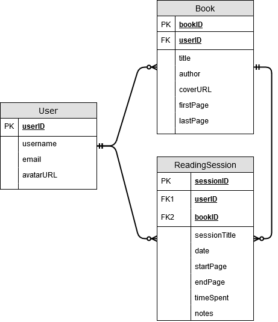

# Pageturns

## Elevator Pitch

Pageturns is an application which helps you plan and manage your reading. Use it to track your reading progress and accomplish your reading goals! Each reading session can be logged and archived with the app, providing you with a valuable record of your notes and thoughts, as well as statistics regarding your progress. Useful information such as reading speed, and pages read over time can be inferred from your reading logs which can then help in planning your future reading goals.

## Requirements

### Functional Requirements - activities performed by the system
* Users should be able to create an account to manage their profile and reading log
* A user's reading log tracks and displays their reading progress
* Users can set reading goals and have the application suggest a suitable pace to reach those goals
* Individual reading sessions can be recorded with information such as time spent, pages read, and notes
* New books can be added and tracked through the reading log
* Statistics such as total pages/books read and reading speed are displayed for each user

### Non-functional Requirements

#### Business - policies
* If ever monetized, the application should be able to limit the number of books and reading sessions which free users can track

#### Performance - workload and response needs
* Ability to handle spikes of activity over weekends and other peaks of leisure time

#### Usability - Colours, logos, online help or docs
* UI and user flow must be intuitive enough to not require any external documentation

#### Reliability - acceptability range
* User data should be recoverable/backed-up

#### Security - amount needed, user permissions, encryption
* Users should have exclusive access their reading log

## Features

### Must-Have
* User Accounts Management
  * Login/Signup method
  * Persistent user profiles
  * Password recovery

* Ability to add new books for the app to track
  * Form for entering book information

* Ability to enter new reading session entries
  * Form for inputting reading session info like time taken, pages read, and any notes taken
  * Persistence of reading session data for each user

* Reading Log View
  * Display reading progress (percentage complete/last page read) for each book

### Nice-To-have

* Statistics (for the past week, month, year, all-time)
  * Pages/Books read
  * Time spent reading
  * Average reading speed

* Goal Setting
  * Views to create and track goals
  * Time estimates for goal completion based on statistics like average reading speed

* Convenience features for managing books
  * Lookup/add new books via metadata like isbn, title, author rather than a manual form
  * Fetch book covers from online APIs

* Global site statistics
  * Most commonly read books/genre
  * Average reading time per user
  * Average number of books read 

* Note-taking features
  * Ability to export all notes made on a book to a single file
  * Specialized note templates based on genre of book

## Entity Relationship Diagram

